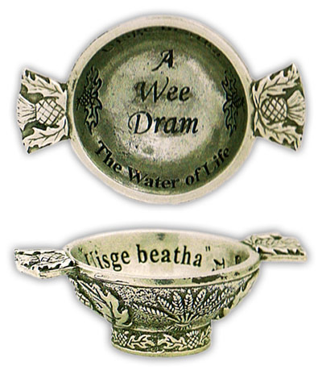

autoscale: true
build-lists: true
theme: Titillium,0


---


---


### quaich: Event-Driven Scala on AWS Lambda
#### A “serverless” microframework for Scala + AWS Lambda
##### or: ‘AWS Lambda, Scala, and Whisky’
<br>
<br>

#### Brendan McAdams \<brendan.mcadams@lightbend.com\>
#### @rit 

---

#[fit] What is a Quaich?


- A traditional Scottish two-handed bowl for serving Whisky!
    + Pronounced like ‘quake’
- Amazon recently released a sample Lambda microframework for Python called “chalice”...
    + It proved a bit inspirational

---

# An idea is born


- Thomas Lockney <[@tlockney](https://twitter.com/tlockney)> and I liked what we saw, and discussed the idea of a Scala version
    + Amazon named theirs chalice...
    + We thought naming *ours* after a serving vessel for whisky was best suited for Scala!

^ Well, the original name was ‘stein’

---

#[fit] AWS Lambda in a Nutshell

- Lambda is a “serverless” framework for event-driven programming on AWS
- It supports Node.js, Python, and JDK 8

^ So, uh, what does serverless mean?

---


---

## Ok, what is “serverless”?

- In a nutshell, cloud computing without provisioning a server instance
- “serverless”: just upload a jar, Amazon autoprovisions execution resources
    + During idle periods, event loop is suspended to prevent usage charges

---

#[fit] AWS Lambda Events

- You write and register a handler function which receives a JSON input
    + The JSON differs based upon the source of the event
- Amazon provides prebuilt event wiring such as triggers from S3 & DynamoDB, and HTTP calls through the API Gateway
    + You can also wire up your own events however you like, and invoke the lambda function from your own AWS code

---

#[fit] ‘chalice’: Our inspiration

- In July, AWS Labs released a sample HTTP microframework for Lambda with Python
    + chalice enables single-page HTTP handling, handling request routing behind the scenes
    + Using Python decorators (an annotation like higher order function), one can define an HTTP route directly on top of the handler function

^ Talk about love of Python, decorators, and lightweight frameworks like Bottle and Flask

---

```python
from chalice import Chalice

app = Chalice(app_name='helloworld')

CITIES_TO_STATE = { 'seattle': 'WA', 'portland': 'OR' }

@app.route('/')
def index():
    return {'hello': 'world'}

@app.route('/cities/{city}')
def state_of_city(city):
    return {'state': CITIES_TO_STATE[city]}
```

---
## Specifying HTTP methods
```python

# optionally, specify accepted HTTP methods; defaults to GET
@app.route('/myview', methods=['POST', 'PUT'])
def myview():
    pass

```

---

## Granted, it's not perfect

- chalice uses the Amazon API Gateway, which must be configured to route HTTP to your Lambda function
- Configuring the Gateway is painful: one must define Velocity templates to include metadata variables (querystring, path, HTTP method, route, etc)
- chalice provides a builtin deployer app that configures all of this for you
- quaich is eventually going to have the same via an SBT plugin

^ for now we are using a 'basic' sbt plugin from Gilt

^ The truth about where we are so far...

---


---

### Fake it til' you make it...


- We've started hacking at quaich & proven all the things we want will work, but the codebase is still inchoate
- While chalice only supports HTTP events, the plan for quaich is to have base traits to support building apps for *any* valid Lambda event
    + Right now, focused on chalice-like HTTP support
- Hoping to release a beta in the next month or so; let's take a look at where we are heading

---


---

### Where the HTTP Support is Now

```scala
object DemoHTTPServer extends HTTPApp {

  @route("/")
  def index(req: LambdaHttpRequest, ctx: LambdaContext): String = {
    """{ "hello" : "world" }"""
  }
```

---

```scala

  @route("/users/{username}")
  def stateOfCity(req: LambdaHttpRequest, ctx: LambdaContext,
    username: String): String = {
    val user = db.getUser(username) match {
      case Some(userData) => userData.toJson
      case None =>
        ctx.log(s"ERROR: User '$username' not found")
        s""" { "error": "No such user" } """
    }
  }

```

^ Right now, the handling of parameters is not ideal

^ The annotation expansion will pull them out as strings, and stuff them into the function call

^ Eventually, we'd like to be able to declare types in the route def, and have appropriate error handling

---

```scala
  @route("/users", methods=Vector(HttpMethod.POST))
  def createUser(req: LambdaHttpRequest, ctx: LambdaContext): String = {
    // Lambda will handle exceptions somewhat nicely, 500ing and logging
    val userData = req.body.extract[User]
    db.createUser(userData)
    s""" { "success": 1 } """
  }

}
```

^ The request object stores the posted JSON body, and we use Json4s extract to pull it into a case class

^ For now, using Json4s but I'd like to support Circe, Jawn, etc as pluggables

^ API Gateway has some cool functionality, like defining validateable JSON Schemas for request and response

---

### The ‘route’ annotation

- The ‘route’ annotation automatically builds (at compiletime) a routing table for the lambda function to invoke functions based on the request path and method
- There's still some debate if we will handle the annotation via a macro, or a compiler plugin
- Annotation handler(s) will generate Scala code, as well as (on disk) metadata & config files for Lambda, API Gateway, S3 Buckets, Permissions, JSON Schemas (based on a case class), etc.

---


---

### Making deploys stupid simple with an sbt plugin

- So far, we're leveraging the [github @ gilt/sbt-aws-lambda plugin from Gilt](https://github.com/gilt/sbt-aws-lambda)
- It is a good start: it creates your Lambda function, a role with permissions to execute, an s3 bucket to hold your jar, and a few other things
- Doing the rest, such as provisioning API Gateways by hand, is unbelievably painful
- You may have noticed me through most of yesterday attempting to get a lot of that working...

^ Plugin has contributions from a few people at this conference including Dick Wall, Gary Coady, and Dale Wijnand

---


---

### The road to a better sbt plugin

- There's a lot more we are going to need, to make quaich excel for rapid development
- Provisioning of the API Gateway, with routes, json schemas, and the JSON body Velocity templates (generated by our annotation processors)
- And, most importantly, easy automated deployment of your Lambda function with said provisioning

^ There's also a newer S3 Upload API I found from Amazon that can show a progress bar, which is sorely needed; there's an undebuggable perceived pause right now

--- 

### One last idea

- Due to our lodging locality, we've had to fly back and forth between SFO each day for the conference
- (Ok. Not really. We're just in a farmhouse deep in the Lake District.)[^†]
- We, uh, also have satellite internet. It makes the Scala compiler look like the fastest thing you've ever seen.
- This got me thinking about how hard it has been to develop & test quaich offline (including) on airplanes...


[^†]: Seriously though, thanks Jon for arranging everything, and doing a great job. The farmhouse is in fact quite lovely

---

### An Offline Simulator?

- Last night, before dinner, I found an interesting Node.js simulator for AWS λ and API Gateway [github @ dherault/serverless-offline](https://github.com/dherault/serverless-offline)
- I couldn't sleep, so I did start prototyping and hacking a similar system for Scala + quaich
- I'm hoping to make a useful version for the first quaich beta

---


^ Questions?

